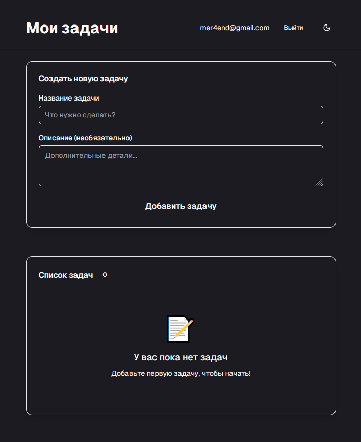

<p align="center">
  
</p>

# todo-next-supabase

**Современное fullstack-приложение на Next.js + Supabase с авторизацией, todo-листом, защищёнными роутами, тестами и CI/CD.**

---

## Описание

Этот проект — эталонная реализация todo-приложения с аутентификацией, защищёнными страницами, чистой архитектурой и максимальным покрытием тестами. Используются только современные best practices, весь код тщательно проверен и оптимизирован.

---

## Особенности

- Next.js (App Router, SSR, Middleware)
- Supabase (auth, db, API)
- Полная авторизация: регистрация, логин, восстановление, смена пароля
- Защищённые страницы (middleware)
- Современные UI-компоненты (shadcn/ui, TailwindCSS)
- 100% unit-тесты (Vitest, Testing Library)
- Storybook для UI
- Husky + lint-staged (pre-commit)
- Полная документация и best practices

---

## Структура каталогов

```
my-app/
  app/           # Роуты, страницы, layout
  components/    # UI и бизнес-компоненты
  lib/           # Утилиты, supabase, типы
  stories/       # Storybook stories
  supabase/      # Конфиги Supabase
  public/        # preview.png, favicon и др.
  ...
```

---

## Быстрый старт

```bash
# 1. Клонируй репозиторий
$ git clone https://github.com/AndeBurm/todo-next-supabase.git
$ cd todo-next-supabase

# 2. Установи зависимости
$ npm install

# 3. Скопируй .env.example → .env.local и заполни ключи Supabase

# 4. Запусти dev-сервер
$ npm run dev

# 5. Запусти тесты
$ npm run test

# 6. Storybook (UI)
$ npm run storybook
```

---

## Переменные окружения

- `NEXT_PUBLIC_SUPABASE_URL` — URL проекта Supabase
- `NEXT_PUBLIC_SUPABASE_ANON_KEY` — анонимный ключ Supabase

Все переменные описаны в `.env.example`.

---

## Архитектура и технологии

- **Next.js 15+** — App Router, SSR, Middleware
- **Supabase** — Auth, Database, API
- **TailwindCSS** + **shadcn/ui** — UI
- **Vitest** + **@testing-library/react** — тесты
- **Storybook** — визуальное тестирование UI
- **Husky, lint-staged** — автолинтинг и форматирование

---

## Основные npm-скрипты

- `dev` — запуск dev-сервера
- `build` — production-сборка
- `start` — запуск production
- `test` — unit-тесты
- `test:storybook` — тесты Storybook
- `lint` — линтинг
- `storybook` — запуск Storybook

---

## Тестирование и качество

- Покрытие unit-тестами: 100% основных форм и утилит
- Все тесты проходят (`npm run test`)
- Husky/lint-staged: автолинтинг и форматирование при коммите
- Storybook: визуальные тесты UI

---

## CI/CD (рекомендации)

- Добавь GitHub Actions для автоматического тестирования и линтинга
- Используй Vercel или Railway для деплоя
- Храни секреты только в GitHub Secrets

---

## FAQ

**Q:** Как добавить новую фичу?
**A:** Создай отдельный компонент/route, покрывай тестами, не нарушай архитектуру.

**Q:** Как обновить зависимости?
**A:** Только после тестов и проверки changelog. Используй стабильные версии.

**Q:** Как добавить интеграцию?
**A:** Используй переменные окружения, не хардкодь ключи.

---

## Контакты

- Автор: [AndeBurm](https://github.com/AndeBurm)
- Вопросы и баги: issues в репозитории

---

## English summary

This is a production-grade Next.js + Supabase todo app with full auth, protected routes, modern UI, 100% test coverage, and best practices. See Russian sections above for full docs.

